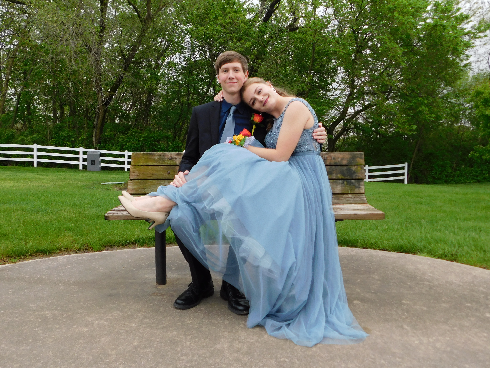
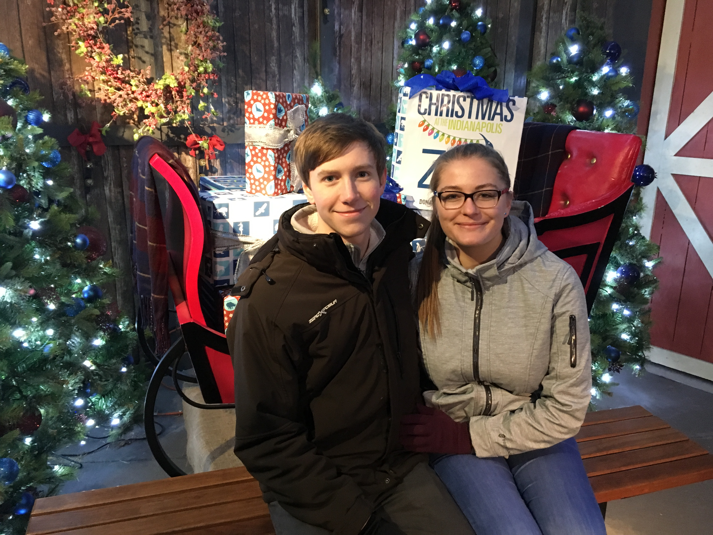
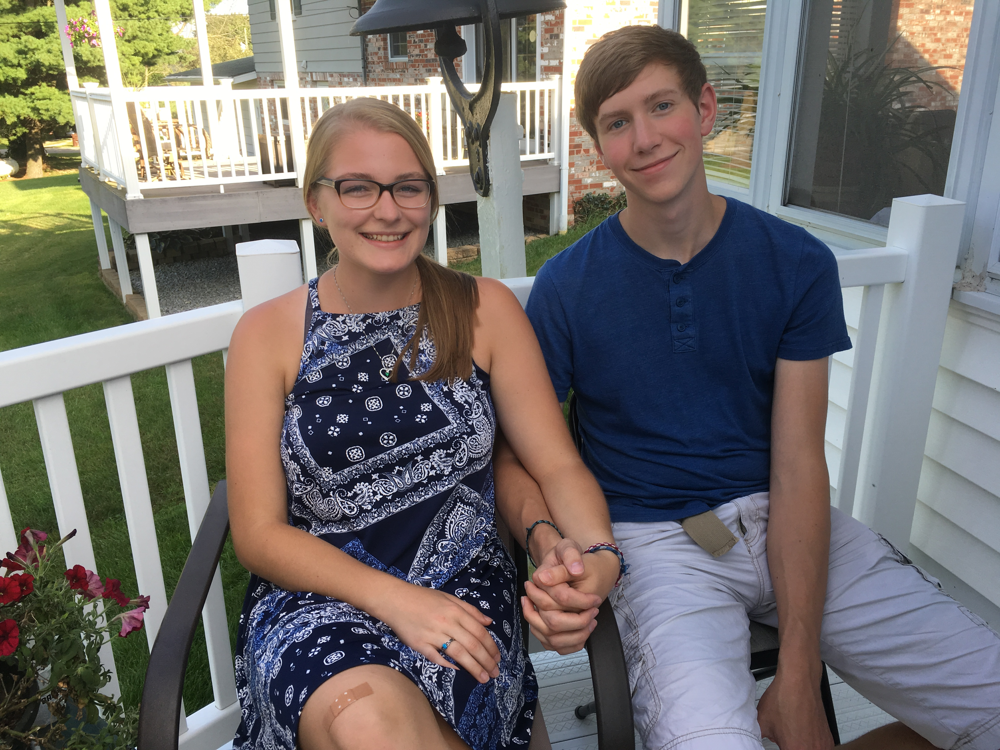
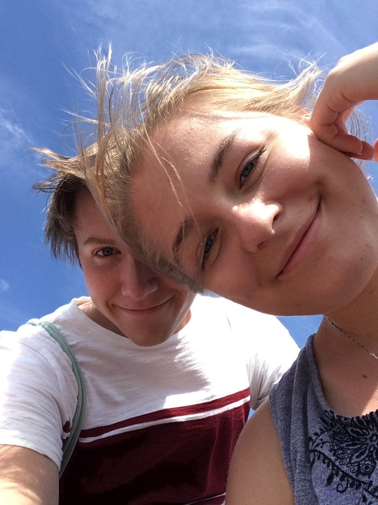
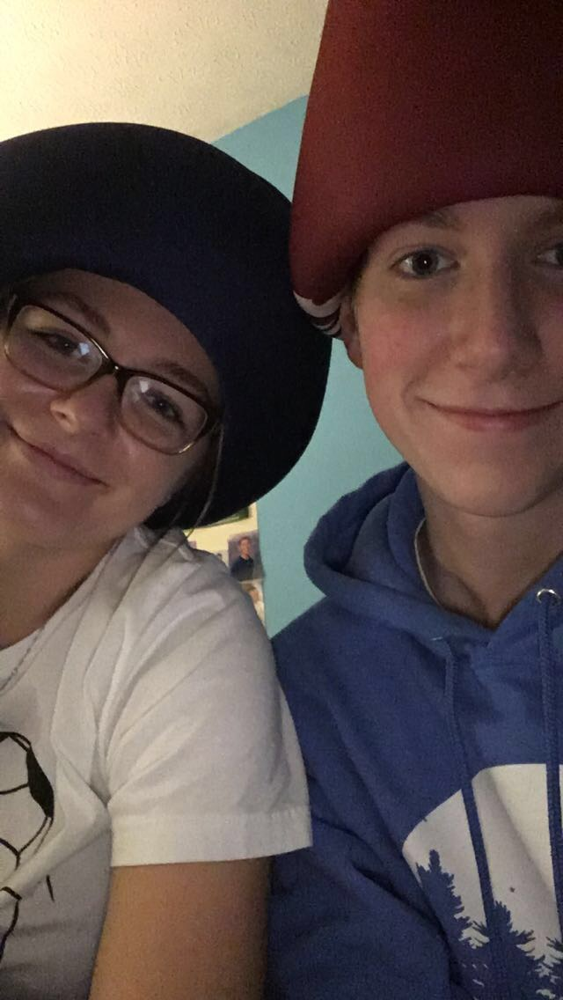

<html lang="en">
<title>Sarah</title>
<meta charset="UTF-8">
<meta name="viewport" content="width=device-width, initial-scale=1">
<link rel="stylesheet" href="https://www.w3schools.com/w3css/4/w3.css">
<link rel="stylesheet" href="https://fonts.googleapis.com/css?family=Lato">
<link rel="stylesheet" href="https://cdnjs.cloudflare.com/ajax/libs/font-awesome/4.7.0/css/font-awesome.min.css">

<body>

<!-- Navbar -->
<!--div class="w3-top">
  

    <a class="w3-bar-item w3-button w3-padding-large w3-hide-medium w3-hide-large w3-right" href="javascript:void(0)" onclick="myFunction()" title="Toggle Navigation Menu"><i class="fa fa-bars"></i></a>
    <a href="#" class="w3-bar-item w3-button w3-padding-large">HOME</a>
    <a href="javascript:void(0)" class="w3-padding-large w3-hover-red w3-hide-small w3-right"><i class="fa fa-search"></i></a>
  

</div-->

<!-- Navbar on small screens (remove the onclick attribute if you want the navbar to always show on top of the content when clicking on the links) -->
<!--div id="navDemo" class="w3-bar-block w3-black w3-hide w3-hide-large w3-hide-medium w3-top" style="margin-top:46px">
</div-->

<!-- Page content -->

  <!-- Automatic Slideshow Images -->
  

    
  

  

    
  

  

    
  

  

    
  

  <!-- The Band Section -->
  

    <h1 class="w3-wide">SARAH</h1>
    
<i>I love you</i>

    
I've had this silly idea in my head for a while, but I haven't had time to get to it till now.
        I hope to update this site daily, however I have no clue if it will even work so lets take it one step at a time.   
    

    

      

        
      

      

        
      

    

  

  <!-- The Tour Section -->
  

    

      <h1 class="w3-wide w3-center">Reasons I love Sarah Bettenbrock</h1>
      

        

          

            
Sun 29 Dec 2019

            
Sarah has an amazing taste in music, and she always introduces me to 
              <a href="spotify:track:2kJwzbxV2ppxnQoYw4GLBZ" target="_blank">songs</a> that I can't get out of my head

              
PS: click on the word songs

          

        

        

          

            
Mon 30 Dec 2019

            
Sarah has an extremely contagious laugh and smile that can always cheer me up if something has me down

          

        

      

      

        

          

            
Tue 31 Dec 2019

            
I love how Sarah intoduces me to new foods that I always end up liking.  I don't want to think about all the amazing stuff I'd be missing out on if I never met her

          

        

        

          

            
Wed 1 Jan 2020

            
I love Sarah because even when she is 4305 miles away, I know that she is still thinking about me.  Happy New Years! I enjoyed the facetime even if it was a lil pixely.  This year is going to be amazing.

          

        

      

      

        

          

            
Thu 2 Jan 2020

            
Being with Sarah, whether at home or out on an adventure, always produces memories that are worth keeping 
              <a href="https://photos.app.goo.gl/w4x9m9ci6VfxiTay8" target="_blank">forever</a>.

              
PS: click on the word forever

          

        

        

          

            
Fri 3 Jan 2020

            
Sarah supports me when I try her hobbies.  I never realized how much I enjoyed playing soccer till I met her.

          

        

      

      

        

          

            
Sat 4 Jan 2020

            
Both Sarah and I can tell each other how we feel, and I know that we both will respect each other afterwards

          

        

        

          

            
Sun 5 Jan 2020

            
She has beautiful blue eyes that I often lose myself in

          

        

      

      

        

          

            
Mon 6 Jan 2020

            
She has beautiful blue eyes that I often lose myself in

          

        

      

    

  

  <!-- The Contact Section -->
  <!--div class="w3-container w3-content w3-padding-64" style="max-width:800px" id="contact">
    <h2 class="w3-wide w3-center">CONTACT</h2>
    
<i>Fan? Drop a note!</i>

    

      

        <i class="fa fa-map-marker" style="width:30px"></i> Chicago, US 
        <i class="fa fa-phone" style="width:30px"></i> Phone: +00 151515 
        <i class="fa fa-envelope" style="width:30px"> </i> Email: mail@mail.com 
      

      

        <form action="/action_page.php" target="_blank">
          

            

              <input class="w3-input w3-border" type="text" placeholder="Name" required name="Name">
            

            

              <input class="w3-input w3-border" type="text" placeholder="Email" required name="Email">
            

          

          <input class="w3-input w3-border" type="text" placeholder="Message" required name="Message">
          <button class="w3-button w3-black w3-section w3-right" type="submit">SEND</button>
        </form>
      

    

  </div-->
  
<!-- End Page Content -->

<!-- Image of location/map -->
<!--img src="/w3images/map.jpg" class="w3-image w3-greyscale-min" style="width:100%"-->

<!-- Footer -->
<footer class="w3-container w3-center w3-opacity w3-light-grey w3-xlarge">
  <i class="fa fa-facebook-official w3-hover-opacity"></i>
  <i class="fa fa-instagram w3-hover-opacity"></i>
  <i class="fa fa-snapchat w3-hover-opacity"></i>
  <i class="fa fa-pinterest-p w3-hover-opacity"></i>
  <i class="fa fa-twitter w3-hover-opacity"></i>
  <i class="fa fa-linkedin w3-hover-opacity"></i>
  
Powered by <a href="https://www.w3schools.com/w3css/default.asp" target="_blank">w3.css</a>

</footer>

</body>
</html>
